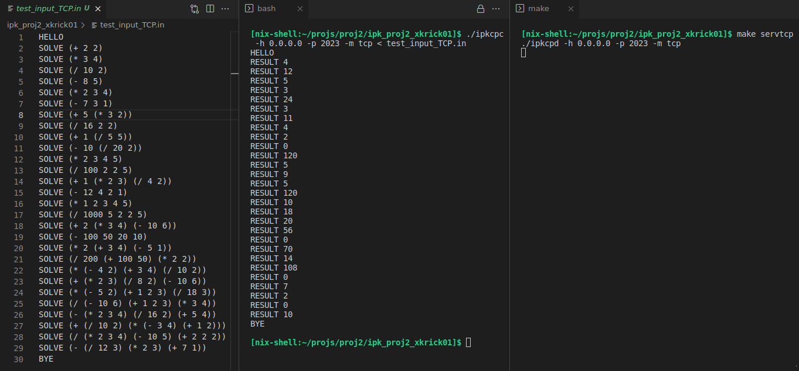
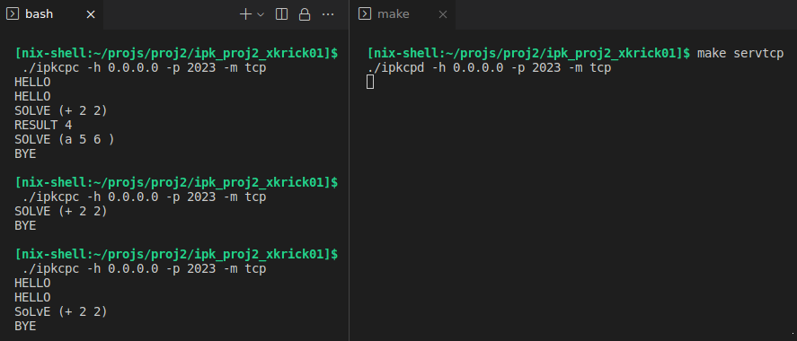
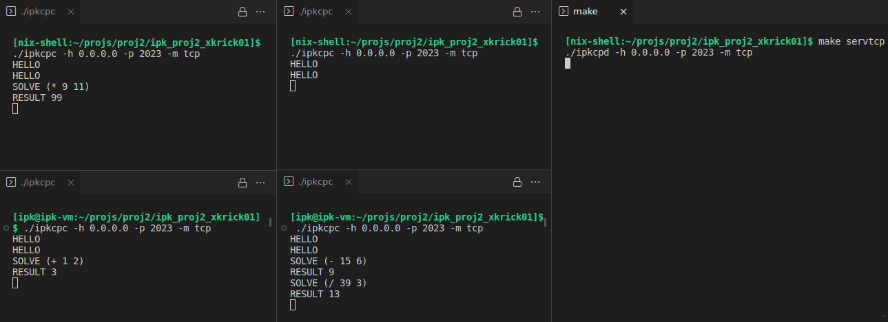
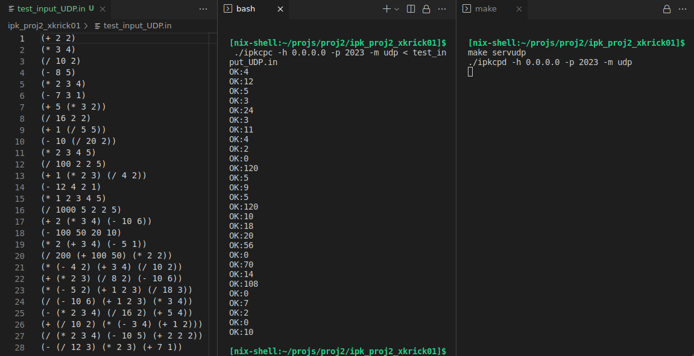
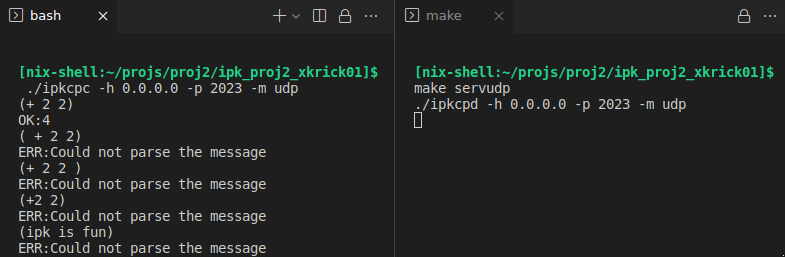
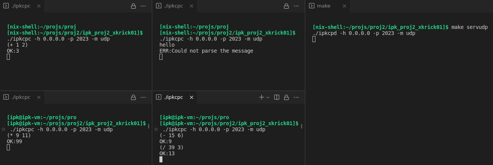
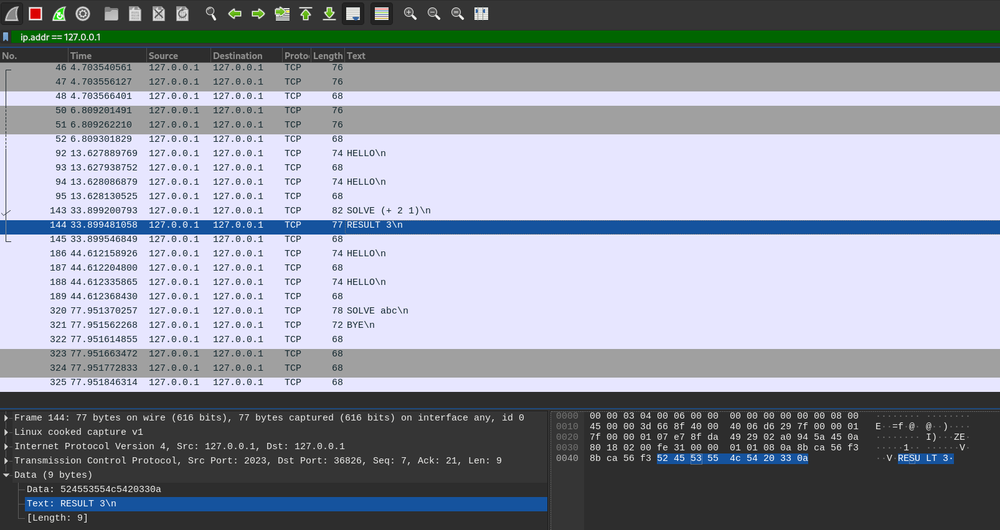

# **Server - Remote calculator**
### Author: `Dalibor Kříčka`
### 2023, Brno

Note: This project was part of the course _Computer Communications and Networks_ at BUT FIT.

---

## **Keywords**
client, server, TCP, UDP, datagram, stream

## **Task Description**
The goal of the project was to implement a server for the [IPK Calculator Protocol](https://git.fit.vutbr.cz/NESFIT/IPK-Projekty/src/branch/master/Project%201/Protocol.md). The server uses TCP mode with a text protocol or UDP mode with a binary protocol for communication with the clients. The server is capable of communicating with multiple clients simultaneously in both modes.
The programming language used for the implementation is C++.


## **Usage**
### **Running the server**
The server is started using the following command:

```
ipkcpd -h <host> -p <port> -m <mode>
```

kde:
* **host** is the IPv4 address of the server
* **port** is the server's port
* **mode** is the communication mode with clients – tcp or udp

The program's parameters can be entered in any order.

### **Displaying help**
The help for the program can be displayed in the following way:

```
ipkcpd --help
```

## **Testing**
The server was tested using the client from the project [Client - Remote calculator](https://github.com/DaliborKr/client-remote_calculator). The tests included verifying the correct processing of the given mathematical expression, as well as the response to both correct and incorrect message formats from the user, and communication with multiple clients simultaneously.

All the tests listed below produce expected results. The testing was performed on the NixOS and Fedora operating systems (with screenshots from NixOS).

### **TCP**
<figure align="center">

<figcaption><b>Img. 2: Testing TCP – Processing of mathematical expressions</b></figcaption>
</figure>

---
<figure align="center">

<figcaption><b>Img. 3: Testing TCP – Incorrectly entered input</b></figcaption>
</figure>

---

<figure align="center">

<figcaption><b>Img. 4: Testing TCP – Communication of multiple clients with the server at the same time</b></figcaption>
</figure>

---

### **UDP**
<figure align="center">

<figcaption><b>Img. 5: Testing UDP – Processing of mathematical expressions</b></figcaption>
</figure>

---
<figure align="center">

<figcaption><b>Img. 6: Testing UDP – Incorrectly entered input</b></figcaption>
</figure>

---

<figure align="center">

<figcaption><b>Img. 7: Testing UDP – Communication of multiple clients with the server at the same time</b></figcaption>
</figure>

---
### **Wireshark**

Monitoring the packets received and sent by the server using the _Wireshark_.

<figure align="center">

<figcaption><b>Img. 8: Testing – Example of packet analysis in the Wireshark</b></figcaption>
</figure>


---

### **Environment**

The program was tested on the following operating systems:
* NixOS
* Fedora
* CentOS/Linux