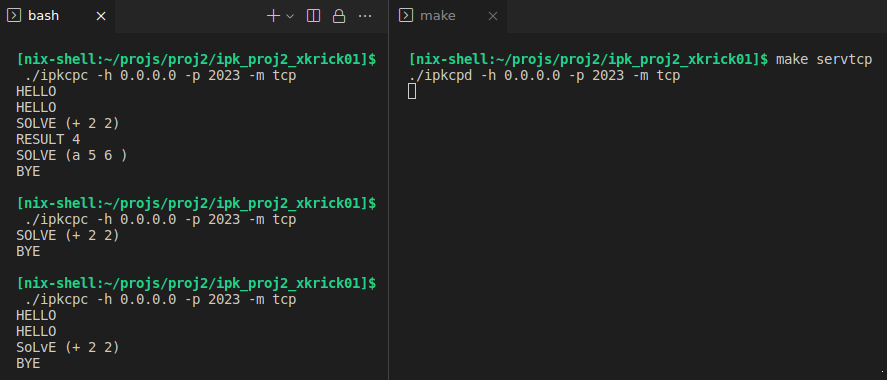
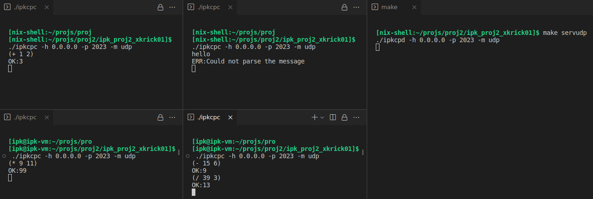

# **Server - Remote calculator**
#### Author: `Dalibor Kříčka`
#### Brno 2023
---

## **Zadání**
Cílem projektu bylo implementovat server pro [IPK Calculator Protocol](https://git.fit.vutbr.cz/NESFIT/IPK-Projekty/src/branch/master/Project%201/Protocol.md). Server využívá pro komunikaci s klienty režim _TCP_ s využitím _textového_ protokolu nebo _UDP_ s využitím _binárního_ protokolu. Server by měl mít schopnost v obou režimech komunikovat s více klienty zároveň.
Programovacím jazykem, který je použit pro implementaci, je jazyk _C++_.

---

## **Použití programu**
### **Spuštění serveru**
Server je spouštěn použitím příkazu:

```
ipkcpd -h <host> -p <port> -m <režim>
```

kde:
* **host** je IPv4 adresa serveru
* **port** je port serveru
* **režim** je režim komunikace s klienty – _tcp_ nebo _udp_

Jednotlivé parametry programu mohou být zádávány v libovolném pořadí.

### **Vypsání nápovědy**
Následujícím způsobem je možné vypsat nápovědu k programu:

```
ipkcpd --help 
```

---

## **Teoretická část**
### **Soket**
Způsob abstrakce operačního systému pro aplikační úroveň. Je to koncový bod komunikace mezi dvěma aplikacemi běžících na síti. Zpravidla má tedy server i klient svůj vlastní soket. Server přidělí soketu port a čeká na klienta, který se s ním pokusí spojit. Klient tedy musí při vytváření svého soketu znát nejen IP adresu na které server běží, ale i číslo portu na kterém naslouchá soket serveru.

Sokety v rámci projektu dělíme na 2 typy podle režimu komunikace:
* **Datagram (UDP)**
* **Stream (TCP)**

### **TCP**
Zajišťuje spojovaný přenos, což znamená, že komunikuje vždy 1 odesílatel s 1 příjemcem, kteří vždy musí před vzájemnou výměnou dat navázat spojení (tzv. handshake). Další významná vlastnost TCP je spolehlivost, jelikož je zpráva přenášena jako kontinuální proud (Stream) bytů a je tak zachováno pořadí jednotlivých bytů dat.

### **UDP**
Protokol UDP je nespojovaná služba, jelikož před komunikací mezi serverem a klientem nenestavá žadné spojení. Zprávy zasílá ve formě datagramů a negarantuje jejich doručení, proto je tato služba označována jako nespolehlivá.

---

## **Implementace programu**
### **Použité knihovny**
Projekt byl naimplementován v jazyce _C++_ s využitím následujících knihoven:
* **iostream** – definuje objekty standardního vstupu a výstupu (_cout_, _cin_)
* **string.h** – definuje funkce pro práci s řetězci typu _char *_
* **regex** – definuje funkce pro práci s regulárními výrazy, využito při validaci zadaných argumentů programu
* **sys/socket.h** a **arpa/inet.h** – poskytují funkce, datové struktury a makra pro síťovou komunikaci, využito pro správu soketů, nastavení informací o hostitelském serveru a odesílání a přijímání zpráv od serveru
* **signal.h** – definuje funkce a makra, které umožňují reagovat na systémové signály, využito pro zachycení signálu přerušení (Ctrl-C)
* **unistd.h**

### **Obsluha více klientů**
Obsluha více klientů byla vyřešena pro každý z režimů jiným způsobem.
#### **TCP**
Pro obsluhu více klientů v režimu _TCP_ bylo využito příkazu `select()`, který je schopen monitorovat množinu deskriptorů všech klientů a následně reagovat na jejich požadavky. V případě, že je na nějaký ze soketů z množiny deskriptorů vznesen klientem požadavek, proiterují se všechny deskriptory, zjistí se, který se má obsloužit pomocí funkce `FD_ISSET()` a provede se příslušný kód (přidání nového klienta do komunikace nebo přijetí, zpracování a odeslání zprávy).

#### **UDP**
Pro obsluhu více klientů u _UDP_ nebylo třeba ze strany serveru implementovat žádnou rošířenou funkcionalitu, jelikož server nenavazuje s klientem spojení a může mu tak kdykoliv jakýkoliv klient poslat zprávu, na kterou dostane ihned opověď.

### **Zpracování matematických výrazů**
Matematické výrazy mohou být dle zadání zanořené (např. (* (+ 1 (- 10 5)) 6 2)) a není je tedy možné zpracovat pomocí regulárních výrazů, jelikož ty nedokáží ze své podstaty řešit rekurzivní problémy. Proto je využita následující bezkontextová gramatika LL(1):

1.  \<expr> -> (\<operator> sp \<expr> sp \<expr> \<opt_expr>)
2.  \<expr> -> integer
3.  \<opt_expr> -> sp \<expr> \<opt_expr>
4.  \<opt_expr> -> ε
5.  \<operator> -> +
6.  \<operator> -> -
7.  \<operator> -> *
8.  \<operator> -> /

Pro každý neterminál je implementována jedna funkce, která se řídí výše uvedenou gramatikou.

### **UML diagram aktivit**
Významné části a celkové chování programu (sekvence jednotlivých kroků) je znázorněno v UML diagramu aktivit (Obr. 1) níže. Stručný slovní popis implementace lze nalézt v souboru [CHANGELOG.md](CHANGELOG.md).

<figure align="center">

<figcaption><b>Obr. 1: UML – Activity diagram</b></figcaption>
</figure>

---

## **Testování**

Testování serveru bylo prováděno pomocí klienta z 1. projektu. Testováno bylo, jak korektní zpracování zadaného matematického výrazu, tak reakce na korektní i nekorektní formáty zpráv od uživatele a komunikace s více klienty najednou.

Všechny níže uvedené testy produkují _očekávané výsledky_. Testování bylo prováděno na operačních systémech _NixOS_ a _Fedora_ (na snímcích NixOS).

### **TCP**
<figure align="center">

<figcaption><b>Obr. 2: Testování TCP – Zpracování matematických výrazů</b></figcaption>
</figure>

--- 
<figure align="center">

<figcaption><b>Obr. 3: Testování TCP – Chybně zadaný vstup</b></figcaption>
</figure>

--- 

<figure align="center">

<figcaption><b>Obr. 4: Testování TCP – Komunikace více klientů se serverem v jeden okamžik</b></figcaption>
</figure>

--- 

### **UDP**
<figure align="center">

<figcaption><b>Obr. 5: Testování UDP – Zpracování matematických výrazů</b></figcaption>
</figure>

--- 
<figure align="center">

<figcaption><b>Obr. 6: Testování UDP – Chybně zadaný vstup</b></figcaption>
</figure>

--- 

<figure align="center">

<figcaption><b>Obr. 7: Testování UDP – Komunikace více klientů se serverem v jeden okamžik</b></figcaption>
</figure>

---
### **Wireshark**

Sledování serverem přijímaných a odesílaných paketů pomocí programu _Wireshark_.

<figure align="center">

<figcaption><b>Obr. 8: Testování – příklad analýzy packetů v programu Wireshark</b></figcaption>
</figure>

---

### **Prostředí**

Program byl testován na následujících operačních systémech:
* NixOS
* Fedora

Na jiných než výše uvedených operačních systémech není zaručena korektní funkcionalita programu (Windows, MacOS, ...) – více viz [CHANGELOG.md](CHANGELOG.md).

---

## **Seznam použité literatury**

* harleenk_99. Socket in Computer Network. _GeeksforGeeks | A computer science portal for geeks_ [online]. Upravil deepanshukamboj. 22. prosinec 2022 [cit. 2023-4-16]. Dostupné na: [GeeksforGeeks](https://www.geeksforgeeks.org/socket-in-computer-network/)

* Přispěvatelé Wikipedie. Síťový socket. _Wikipedie: Otevřená encyklopedie_ [online]. 9. leden 2023 [cit. 2023-4-16]. Dostupné na: [Wikipedie](https://cs.wikipedia.org/wiki/S%C3%AD%C5%A5ov%C3%BD_socket)

* Oracle. What Is a Socket?. _The Java Tutorials_ [online]. © 1994-2023 [cit. 2023-4-16]. Dostupné na: [The Java Tutorials](https://docs.oracle.com/javase/tutorial/networking/sockets/definition.html)

* GeeksforGeeks. Socket Programming in C/C++: Handling multiple clients on server without multi threading. _GeeksforGeeks | A computer science portal for geeks_ [online]. 28. červen 2022 [cit. 2023-4-15]. Dostupné na: [GeeksforGeeks](https://www.geeksforgeeks.org/socket-programming-in-cc-handling-multiple-clients-on-server-without-multi-threading/)